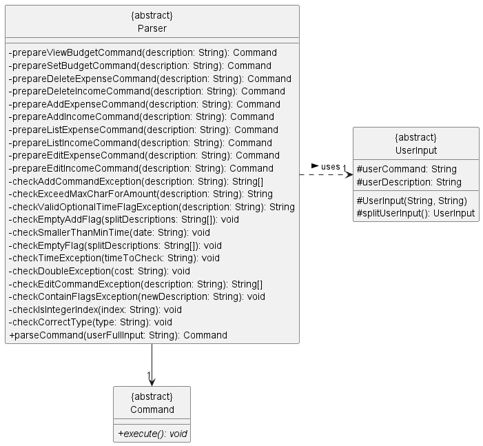
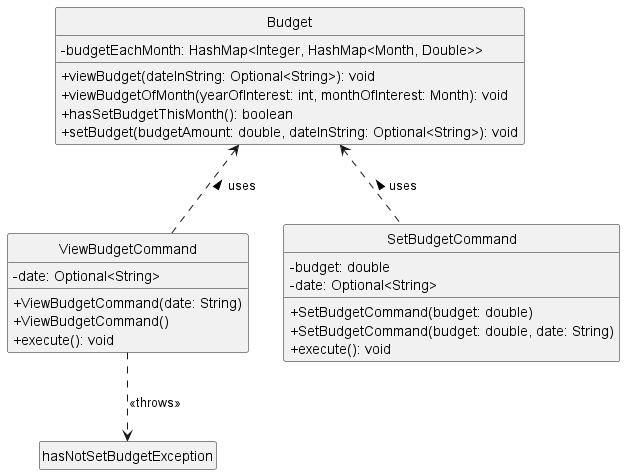
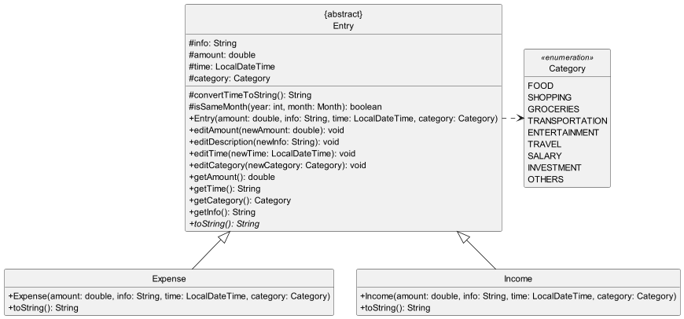
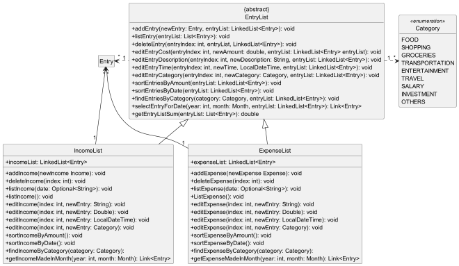

# Developer Guide

## Table of Contents

1. [Acknowledgements](#acknowledgements)
2. [Design](#design)
   - [Architecture](#architecture)
   - [UI component](#ui-component)
   - [Parser component](#parser-component)
   - [Command component](#command-component)
   - [Save component](#save-component)
   - [EntryList Component](#entrylist-component)
   - [Budget Component](#budget-component)
   - [Common class](#common-class)
   - [Exception classes](#exception-classes)
3. [Implementation](#implementation)
   - [Entry](#entry)
   - [EntryList](#entrylist)
   - [ExpenseList, IncomeList](#expenselist-incomelist)
   - [Budget](#budget)
   - [SaveExpense, SaveIncome, SaveBudget](#saveexpense-saveincome-savebudget)
   - [Wishlist (COMING SOON)](#wishlist-coming-soon)
   - [Spending Advisor (COMING SOON)](#spending-advisor-coming-soon)
4. [Appendix: Requirements](#appendix-requirements)
   - [Product Scope](#product-scope)
   - [User Stories](#user-stories)
   - [Use cases](#use-cases)
5. [Appendix: Instructions for manual testing](#appendix-instructions-for-manual-testing)

---

## Acknowledgements

Below are links to the codes that this program has partly referenced and adapted from.

- [addressbook-level2](https://github.com/se-edu/addressbook-level2)
- [addressbook-level3](https://github.com/se-edu/addressbook-level3)

[back to contents](#table-of-contents)

---

## Design

### Architecture

The ***architecture diagram*** given above explains the high level design of the program.

Given below is a quick overview of the main components and how they interact with each other.

**Main components of architecture**

`BrokeMan` has one class [`Main`](https://github.com/AY2223S2-CS2113-F13-2/tp/blob/master/src/main/java/seedu/brokeMan/BrokeMan.java), which is responsible for:
- At program launch: Initialises the components in the correct sequence, and connect them up with each other
- At program termination: Shuts down the components and invokes cleanup methods where necessary.

[`Common`](#common-class) represents a collection of messages used by multiple other components.
[`Exception`](#exception-classes) represents a collection of custom exceptions used by multiple other components.

The rest of the program consists of mainly 5 main components.
- [`Ui`](#ui-component): The Ui of the program.
- [`Parser`](#parser-component): The user input parser.
- [`Command`](#command-component): The command executor.
- [`Save`](#save-component): Reads data from, and writes data to hard disk.
- [`EntryList`](#entrylist-component): The abstract class (with subclasses `IncomeList` and `ExpenseList`) that contains
an `Entry` of linkedList which stores 
the list of entries (incomes / expenses) and its method when program is running.
- [`Budget`](#budget-component) : Stores the list of budget amounts in `budgetEachMonth` and its methods when program is running.

**How the architecture components interact with each other**

The program will first load the content of the .txt files in the `Data` folder if exists,
and populate the `incomeList`, `expenseList`, and `budgetEachMonth`. The `user`'s interactions with
the `Ui` will be parsed to the `Command` using the `Parser`, and the `parser` will then return the `Command` object
specified, which the `Ui` can execute and format the output to the `user`. When the `user` exits the program, the `Save`
command will be executed and the content in the `entryList` (more specifically `incomeList`, `expenseList`) from `EntryList`, and `budgetEachMonth` from `Budget` will then be
stored into their respective .txt files in the `Data` folder.

[back to contents](#table-of-contents)

---

### Ui component

The **API** of this component is specified in [`Ui.java`](https://github.com/AY2223S2-CS2113-F13-2/tp/blob/master/src/main/java/seedu/brokeMan/ui/Ui.java)

Below is the UML diagram for Ui class:

The Ui consists of methods to read inputs from user and to format the outputs to be displayed to the user.

[back to contents](#table-of-contents)

### Parser component

The **API** of this component is specified in [`Parser.java`](https://github.com/AY2223S2-CS2113-F13-2/tp/blob/master/src/main/java/seedu/brokeMan/parser/Parser.java)

Below is the UML diagram for Parser class:

How the `Parser` component works:
1. When the `BrokeMan` class calls the `Parser` class to execute a command using the `parseCommand` method. 
2. The `parseCommand` method uses `UserInput` class to split the user input in two, command input and description of command.
3. Depending on the command input, the `parseCommand` method will call its respective `prepareXCommand` (i.e, `prepareDeleteExpenseCommand`).
4. The `prepareXCommand` will then return the respective Command object (i.e, `deleteExpenseCommand`) back to the `parseCommand` method and then to the `BrokeMan` class.

[back to contents](#table-of-contents)

---

### Command component

The `Command` component consists of many `Command` classes that executes different commands of the program
when called. It is stored in the [`seedu.brokeMan.command`](https://github.com/AY2223S2-CS2113-F13-2/tp/tree/master/src/main/java/seedu/brokeMan/command) package.

The sequence diagram below shows how the components interact with each other for the scenarios where the user
issues the commands `deleteExpense 1` and `exit`.

When the `Ui` reads `"deleteExpense 1"` from `User`, it calls the `parseCommand()` method from `Parser` class
to help parse the user input to `Command` (more specifically, `DeleteExpenseCommand`).
In the `parseCommand()` method, it calls the `prepareDeleteExpenseCommand()` method to help convert the `String` "1" to
`int` 1, and handle the necessary `exceptions`. It then returns a newly constructed `DeleteExpenseCommand(1)` object to `parseCommand()`
method and back to `Ui`. The `Ui` executes the `excute()` method in `DeleteExpenseCommand` object which will call the
`deleteExpense()` method in `EntryList` which will delete the entry of expense in its entryList. The `Ui` will
display successful deletion of expense entry upon completion of delete command.

When the `Ui` reads "exit" from the `User`, it similarly calls the `parseCommand()` method from
`Parser` class to help parse the user input to `Command` (more specifically, `ExitCommand`).
The `Parser` class will return a newly constructed `ExitCommand()` object back to the `Ui`.
The `Ui` executes the `execute()` method of the `ExitCommand` which will call writeFile method in the `SaveBudget`,
`SaveExpense`, and `SaveIncome` classes, in the `Save` folder, and write the content to its respective `.txt`
files in the `Data` folder. Upon completion of the save command, the `Ui` will print the goodbye messages to the
`User` and terminate the program.

[back to contents](#table-of-contents)

---

### Save component

The **API** of this component is specified in [`SaveBudget.java`](https://github.com/AY2223S2-CS2113-F13-2/tp/blob/master/src/main/java/seedu/brokeMan/save/SaveBudget.java), [`SaveExpense.java`](https://github.com/AY2223S2-CS2113-F13-2/tp/blob/master/src/main/java/seedu/brokeMan/save/SaveExpense.java), [`SaveIncome.java`](https://github.com/AY2223S2-CS2113-F13-2/tp/blob/master/src/main/java/seedu/brokeMan/save/SaveIncome.java)

The `Save` component,

- can save entryList data and budget data in the hard disk as .txt files, and read them back into corresponding objects.
- depends on some classes in the EntryList component and Budget component(because the Save component’s job is to save/retrieve objects that belong to the EntryList and Budget)

[back to contents](#table-of-contents)

---

### EntryList component

The **API** of this component is specified in [`EntryList.java`](https://github.com/AY2223S2-CS2113-F13-2/tp/blob/master/src/main/java/seedu/brokeMan/entry/EntryList.java)

The `EntryList` component,
- stores the entry list data i.e., all `Entry` objects (which can inherit the behavior of `Expense` class or `Income` class)
- stores the `EntryAmountComparator` and `EntryDateComparator` to filter the list. The UI can be bound to this list so that the UI automatically updates when the data in the list change.
- does not depend on any of the other three components (as the `EntryList` represents data entities of the domain, they should make sense on their own without depending on other components).

Here is the (partial) UML diagram of the `EntryList` component:

[back to contents](#table-of-contents)

---

### Budget component

The **API** of this component is specified in [`Budget.java`](https://github.com/AY2223S2-CS2113-F13-2/tp/blob/master/src/main/java/seedu/brokeMan/budget/Budget.java)

The `Budget` component,
- stores the monthly budget data in a hashmap
- does not depend on any of the other three components (as the `Budget` represents data entities of the domain, they should make sense on their own without depending on other components).

Here is a UML diagram of the `Budget` component:

### Common class

Messages used by multiple components are in the [`seedu.brokeMan.common`](https://github.com/AY2223S2-CS2113-F13-2/tp/tree/master/src/main/java/seedu/brokeMan/common) package.

[back to contents](#table-of-contents)

---

### Exception classes

Possible exceptions in multiple components are defined in the [`seedu.brokeMan.exception`](https://github.com/AY2223S2-CS2113-F13-2/tp/tree/master/src/main/java/seedu/brokeMan/exception) package.

[back to contents](#table-of-contents)

---

## Implementation

### Entry

Below is the UML class diagram for Entry:

Entry class is the underlying superclass for Expense and Income classes. It establishes the common attributes and
methods that are necessary to represent Expenses and Incomes. Abstract class is used to represent their common features
to maximize code reusability and increase maintainability.

**Methods**

Getters can be used to provide the private attributes to other classes

editDescription(), editAmount(), editTime(), editCategory()

* Takes in corresponding parameters to edit the private attributes.
* Used by EntryList to make edits

isSameMonth()

* Takes in Integer year and Month and returns if the entry is made in the date specified by parameters.

[back to contents](#table-of-contents)

---

### EntryList

Below is the UML class diagram for EntryList:

The EntryList class represents a collection of Entry instances. It is an abstract class that serves as a superclass for
ExpenseList and IncomeList classes, providing common functionalities to minimize repetitive code and easing code
maintenance. It provides underlying methods for adding, removing, editing, and listing entries from the list, which can
be expenses or incomes depending on the subclass.

On top of the methods that provide basic functionality of expense/income lists, the EntryList class provides additional
methods such as summing all entries or filtering the entries according to LocalDate provided to the method. Most methods
of EntryList take in a List<Entry>, which is because it has to operate on a list of expenses or incomes passed by the
IncomeList or ExpenseList subclasses.

**Methods**

addEntry(), listEntry(), deleteEntry(), editEntry()

* Underlying methods of the add, edit, view, and delete features of Expense and Income class. 
* Edit entry has different methods for each data stored in an entry. (E.g. amount, time...etc).

   
getTotalAmount(), sortEntriesByAmount(), sortEntriesByDate(), findEntriesByCategory(), selectEntryForDate(), getEntryListSum()

* Underlying methods of subclasses of EntryList, which are used to implement features that extends beyond the CRUD features.
* They all take in a list of entries, which are IncomeLists or ExpenseLists, then returns appropriate data back to the subclass.

[back to contents](#table-of-contents)

---
   
### ExpenseList, IncomeList

Classes ExpenseList and IncomeList are responsible for keeping track of the corresponding entry instances added to the program by the user. 
At a class level, it keeps a **LinkedList** of corresponding entries. 
They both extend EntryList, the abstract class that represents a collection of Entry instances. 
It provides static functionalities of managing and viewing entry instances at a class level. 
Instances of ExpenseList and IncomeList are not created as all functionalities can be provided at the class level. 
  
**Methods**

listExpense() / listIncome()

* Overloaded method, may take it no parameter or LocalDate parameter
* If it has no passed parameters, it returns all entries in the list
* If a LocalDate is passed, it returns all entries made in the month specified by LocalDate instance.

[back to contents](#table-of-contents)

---

### Budget

The Budget class represents the user’s monthly budget. The class utilize class-level hashmaps to represent the monthly
budget, using outer key year and inner key month. It provides a method to set and view budget for different months.

It makes use of a static HashMap<Integer, HashMap<Month, Double>> to keep track of monthly budget. If the user tries to
access budget using keys that are not entered in the HashMap, it will return a warning mentioning that the inquired
budget has not been set yet.

[back to contents](#table-of-contents)

---

### SaveExpense, SaveIncome, SaveBudget

The SaveExpense, SaveIncome, SaveBudget classes deal with saving in the user inputted data locally.
So that it can all be later accessed.
They all save once the exit command is set.
So assuming there are no bugs it should save.

**Methods**

writeFile(LinkedList<Entry> expenses/incomes)
* writes to the file in a similar format that is entered in to make a new Expense object within the constructor.

readExpenseFile()

* This method reads in from the saved file either ExpenseData.txt or IncomeData.txt. 
* Reads in and initialized each line as either expense or income. 
* Then adds to the respective list.

writeFile(HashMap<Integer, HashMap<Month, Double>> budget)
* This method writes to the file under ./data/BudgetData.txt file.
* Will write upon exit.
* organizes it based on how it the information is constructed for easy reading.
* Iterates through the outer HashMap then inner.

public static HashMap<Integer, HashMap<Month, Double>> readFile()
* On start up reads through the file ./data/BudgetData.txt.
* Reads in and the year then as a key then the monthly declared budget of the given months.
* Returns this as the initialized budget on start.

[back to contents](#table-of-contents)

---

### Wishlist (COMING SOON)
   
The Wishlist class represents a good or a product the user wants to purchase in the future that are expensive enough, prompting the user to save up. Users can funnel their income entry to a specific wishlisted-product. Users can view how much percentage of the good's price they have saved up, which can give them further motivation to cut their spendings. Users will be able to add a list of wishlisted products. 
   
They can be implemented through a structure that is similar to Entry and EntryList. Each wishlisted product will be a separate class that stores the information of the good, such as name, price, and the date of wishlist created. 
   
The wishlist entry can then be arranged to a list, where users can easily navigate and compare between different wishlisted products. They can also give priority value to each wishlisted product, which can be used to sort them.

[back to contents](#table-of-contents)

---

### Spending Advisor (COMING SOON)
   
The spending advisor will be integrated to the product by assisting users to make best consumption choices. The advisor will help users compare prices from different food outlets and shops. As the target user for this program is students, the program will first implement food stalls and shops in NUS, which is where the developers for this program are enrolled. In subsequent iterations of the program, the advisor will expand into other regions and recommend users of the best-value purchases.

[back to contents](#table-of-contents)

---

## Appendix: Requirements

### Product scope

**Target user profile**:

- BrokeMan is suitable for students who have to work with tight budgets
- students who want to use their money efficiently
- students who want to minimize their spending.
- students who can type fast
- prefer typing to mouse interactions
- is reasonably comfortable using CLI apps

**Value proposition**:

- Manage income and expenses faster than a typical mouse/GUI driven app
- The program will offer visualization of the user's incomes, expenses and budget, allowing them to recap and be mindful
  about their financial status. The project will allow division of budget into multiple subcategories of expenses. In
  essence, the program sets students up for a better financial future.

[back to contents](#table-of-contents)

---

### User Stories

Priorities: High (must have) - `* * *`, Medium (nice to have) - `* *`, Low (unlikely to have) - `*`

| Priority | Version | As a ... | I want to ...                                  | So that I can ...                                                                 |
|----------|---------|----------|------------------------------------------------|-----------------------------------------------------------------------------------|
| `* * *`  | v1.0    | user     | add my income                                  | add my new incomes and keep track of them                                                                 |
| `* * *`  | v1.0    | user     | delete my income entered                       | delete incorrectly added or unwantedincomes                                     |
| `* * *`  | v1.0    | user     | edit my income previously entered              | edit a component of my income without having to delete and re-entering the income |
| `* * *`  | v1.0    | user     | list my incomes                                | track all of my incomes and take a look at them at once                                                         |
| `* * *`  | v1.0    | user     | add my expenses                                | add my new expenses and keep track of them                                                                  |
| `* * *`  | v1.0    | user     | delete my expenses entered                     | delete incorrectly added or unwanted expenses                                    |
| `* * *`  | v1.0    | user     | edit my expense previously entered             | edit a component of my expense without having to delete and re-enter the expense  |
| `* * *`  | v1.0    | user     | list my expenses                               | track all my expenses and take a look at them at once                                                             |
| `* * *`  | v1.0    | user     | set and view my budget                         | set expectation of how much money I should use                                    |
| `* * *`  | v1.0    | user     | view how much of the budget I spent            | keep track of my spending status, as well as manage and change my spending habit as necessary                                  |
| `* *`    | v1.0    | user     | view all command that I can enter              | get help on the features if necessary                                             |
| `* *`    | v2.0    | user     | list monthly expenses, income, and budget      | refer to financial status in previous months                                      |
| `* *`    | v2.0    | user     | save all my income and expenses entered        | so that I can refer to it next time I reopen the program                                     |
| `* *`    | v3.0    | user     | add goods on wishlist                          | so that I can save my incomes to purchase them                                    |
| `* `     | v3.0    | user     | compare different spending options in the area | so that I can make the best-value purchases                                       |

[back to contents](#table-of-contents)

---

### Use cases

(For all use cases below, the System is the `BrokeMan` and the Actor is the `user`, 
unless specified otherwise)

#### Use case: Delete an expense

#### MSS

1. User requests to list expenses.
2. BrokeMan shows a list of expenses.
3. User requests to delete a specific person in the list.
4. BrokeMan deletes the person.

    Use case ends.

#### Extensions
* 2a. The list is empty.
    
    Use case ends.
* 3a. The given index is invalid.
  * 3a1. BrokeMan shows an error message.

    Use case resumes at step 2.

[back to contents](#table-of-contents)

---

### Non-Functional Requirements

1. Should work on any mainstream OS as long as it has Java 11 or above installed.
2. Should be able to hold up to 1000 entries without a noticeable sluggishness in performance for typical usage.
3. A user with above average typing speed for regular English text (i.e. not code, not system admin commands) should be able to accomplish most of the tasks faster using commands than using the mouse.

[back to contents](#table-of-contents)

---

## Glossary

- **Mainstream OS**: Windows, Linux, Unix, OS-X
- Command Line Interface (CLI)

[back to contents](#table-of-contents)

---

## Appendix: Instructions for manual testing

{Give instructions on how to do a manual product testing e.g., how to load sample data to be used for testing}

1. Download the latest .jar file from [here](https://github.com/AY2223S2-CS2113-F13-2/tp/releases/tag/v2.1).
2. Open the folder that the .jar file is in and run the program in your terminal using `java -jar CS2113-F13-2_BrokeMan.jar`.
3. Read through the user guide to get the detailed instructions for the various features of the program.
4. Additional, user can see all the available commands and a less detailed description of them by entering `help`.
5. Add an expense at 2023/04/01 at 12:00 using the command `addExpense a/ 5.0 d/ lunch t/ 2023 04 01 12 00 c/ FOOD`.
6. Delete expense using the command `deleteExpense 1`.
7. Edit an expense using the command `editExpense i/ 1 t/ amount n/ 12.5`.
8. List all expenses across the entire time period using the command `listExpense`.
9. List all expenses for the month specified using the command `listExpense t/ 2023/04`.
10. Add an income at 2023/04/01 at 12:00 using the command `addIncome a/ 4000 d/ salary t/ 2023 04 01 12 00 c/ SALARY`.
11. Delete an income using the command `deleteIncome 1`.
12. Edit an Income using the command `editIncome i/ 1 t/ info n/ stocks`.
13. List all incomes across the entire time period using the command `listIncome`.
14. List all incomes for the month specified using the command `listIncome t/ 2023/04`.
15. Set a budget for current month using the command `setBudget 500`.
16. Set a budget for a specific month using the command `setBudget 500 t/ 2023/05`.
17. View budget for current month and amount of budget remaining using the command `viewBudget`.
18. View budget for the month specified and the amount of budget remaining using the command `viewBudget t/ 2023/05`.
19. View Expenses by decreasing amount using the command `sortExpenseByAmount`.
20. View Income by decreasing amount using the command `sortIncomeByAmount`.
21. View Expenses by dates from the latest to oldest using the command `sortExpenseByDate`.
22. View incomes by dates from the latest to oldest using the command `sortIncomeByDate`.
23. Exit and save the content of the program by using the command `exit`.

[back to contents](#table-of-contents)
